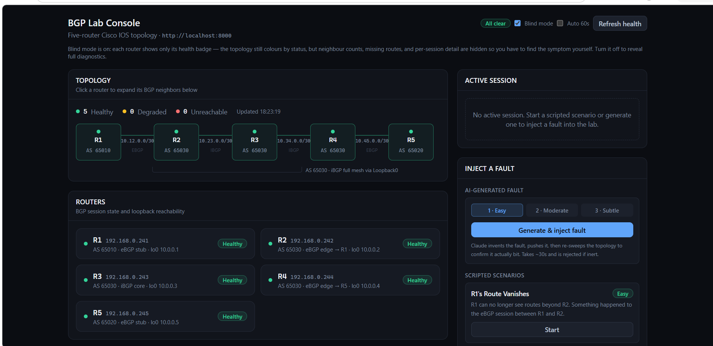
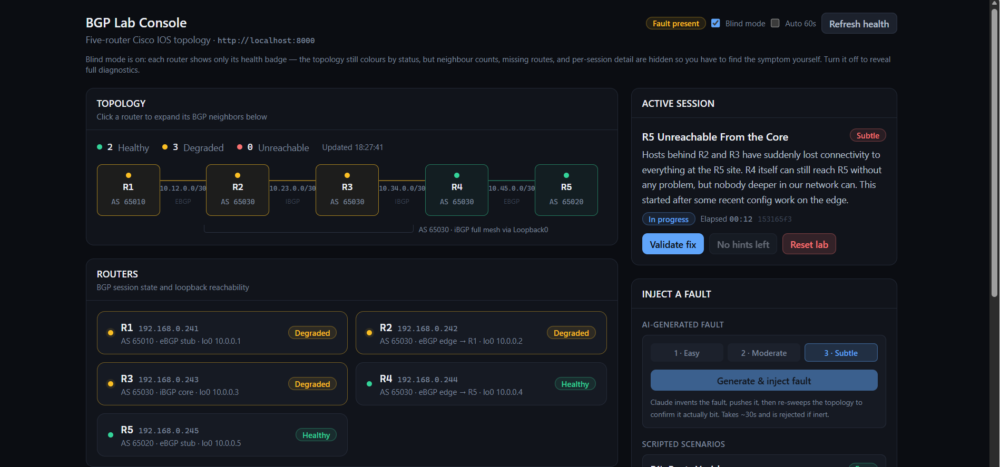
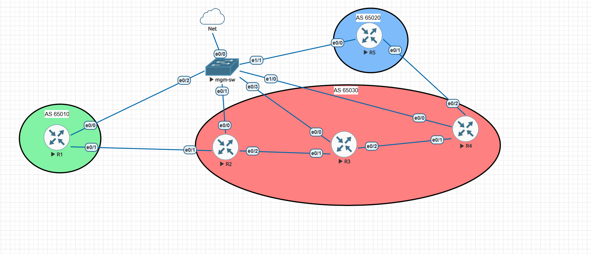
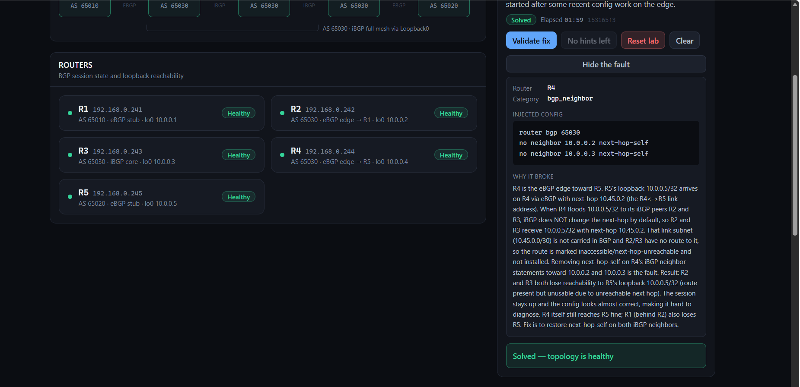

# BGP Fault Injection & Validation Platform

Automated BGP fault-injection and validation platform for a multi-AS Cisco lab. An LLM generates fault scenarios within a constrained schema; the backend validates the commands, injects them over an isolated management network, verifies they changed real network state, and validates fixes across the full topology.

## Why I built it

I wanted to get better at troubleshooting BGP, and the usual options didn't work for me. Fixed lab scenarios are the same every time — once you've done them, you're recalling an answer rather than diagnosing a problem. Breaking things yourself doesn't work either, because you already know what you broke. And a lot of "troubleshooting practice" is really just copying commands out of a guide without any investigation happening at all.

What I wanted was something that breaks the network in a way I haven't seen before, gives me a symptom rather than a cause, and makes me find it. I couldn't find anything free that did that, so I built it.

## What it does



You pick a difficulty level and start a session. The backend asks an LLM to design a BGP fault appropriate to that difficulty, validates the generated commands, pushes them to a router over SSH, and confirms the fault actually broke something before handing you the exercise.



You get a trouble ticket written the way a user would report it — the symptom, not the cause. You SSH into the routers, investigate, and fix it. When you think you're done, you hit Validate, and the platform checks whether the network is genuinely healthy again. Afterwards it reveals what was injected and explains the mechanism.

## Topology

Five Cisco IOL routers in EVE-NG across three autonomous systems:

    

- **R1** — AS 65010, eBGP stub
- **R2, R3, R4** — AS 65030, iBGP full mesh peering over loopbacks, OSPF underlay carrying the sessions. R2 and R4 are the eBGP edges; R3 is pure iBGP transit.
- **R5** — AS 65020, eBGP stub

Loopbacks `10.0.0.1–5/32` are the reachability targets. Transit links are `/30`s.

Out-of-band management: every router's `Ethernet0/0` sits on a separate management segment (`192.168.0.241–245`) bridged to the host. All backend SSH runs over this path, entirely off the data plane. Fault injection can never affect it — by topology and by explicit command validation.

## Architecture

```
Browser ──HTTP──> FastAPI backend ──SSH (OOB)──> R1..R5 (EVE-NG)
                        │
                        └──HTTPS──> Anthropic API (fault generation)
```

- **Backend**: FastAPI, Netmiko for SSH, ntc-templates for structured parsing of show output
- **Frontend**: React + Vite + Tailwind
- **Lab**: EVE-NG (Cisco IOL images supplied by the user — see Prerequisites)

## How fault injection works



1. **Target selection** — a router is chosen server-side, weighted by difficulty, rather than left to the model.
2. **Generation** — the LLM returns a structured tool call: target router, fault category, fault commands, fix commands, a plain-English trouble ticket, and two progressive hints.
3. **Command validation** — generated commands are checked against a forbidden list. Anything touching the management interface, SSH, AAA, credentials, or removing an entire BGP process is rejected before it reaches a device.
4. **Snapshot** — the target router's running-config is captured.
5. **Injection** — commands are pushed via Netmiko, followed by a BGP soft clear when route policy is involved (IOS doesn't re-evaluate existing routes when policy is attached to an established session).
6. **Effect verification** — the topology is re-swept and diffed against the pre-injection state. If nothing changed, the fault was inert: it's rolled back, no session is created, and an error is returned.

## How validation works

Validation is topology-wide and protocol-agnostic. It checks two independent things:

- **Control plane** — every BGP session on every router is Established
- **Data plane** — every router can route to every other router's loopback

Both are necessary. A route-map filtering prefixes leaves all sessions Established, so a session-state check passes a network that can't route. Conversely, checking only BGP-learned routes produces false failures here: OSPF (AD 110) and iBGP (AD 200) both carry the loopbacks, OSPF wins, and BGP's path is marked RIB-failure despite the network being entirely healthy. So reachability is checked per-prefix regardless of which protocol installed the route.

## Reset

Reset sends the stored fix commands first, then replays the pre-fault snapshot as a safety net. The order matters: IOS config push is a merge, so a snapshot can add lines back but can never remove what a fault added. A route-map, prefix-list, and neighbor attachment all survive a snapshot replay untouched.

The snapshot is filtered before replay — management-plane blocks (`line vty`, `line con`, `ip ssh`, `transport input`, `username`, AAA, and the management interface) are stripped, block-aware so indented sub-commands go with their parent. Without this, replaying a config captured while a router was in a degraded state can re-apply that state; in testing it disabled SSH on four of five vty lines and caused connection failures that took a while to trace back.

## Features

- LLM-generated faults across three difficulty levels
- Three scripted YAML scenarios as a fallback that runs without an API key
- Live topology and per-router health dashboard
- Progressive hints with an escalating cost
- Blind mode — hides diagnostic detail so the symptom has to be found at the CLI rather than read off the dashboard
- Post-solve reveal showing the injected config and an explanation of why it broke

## Prerequisites

- EVE-NG with your own Cisco IOL images (these cannot be redistributed — obtain them through your own Cisco licensing)
- Python 3.11+
- Node 20.19+
- An Anthropic API key (optional — scripted scenarios work without one)

## Setup

```bash
git clone https://github.com/ah7m02/bgp-fault-platform.git
cd bgp-fault-platform

pip install -r requirements.txt
cp .env.example .env      # fill in your API key, router IPs, and credentials

python -m uvicorn main:app --reload
```

```bash
cd frontend
npm install
npm run dev
```

Dashboard at `http://localhost:5173`, API docs at `http://localhost:8000/docs`.

Build the topology in EVE-NG per the diagram above, with each router's `Ethernet0/0` on a management segment reachable from the host running the backend.

## Known limitations

- Sessions are held in an in-process dict — no persistence, so a backend restart drops active sessions, and no locking, so concurrent access to session state is racy
- Concurrent fault generation isn't serialized; two simultaneous generations could interfere
- Effect detection polls for up to 30s. A fault whose symptom only appears on BGP hold-timer expiry could still read as inert and be rolled back
- Rollback of an inert fault uses the fix commands only. If rollback itself fails, config can survive on the device with no session to clean it up — the API reports this rather than retrying blindly
- Loopback addressing is hardcoded as topology fact, not configuration
